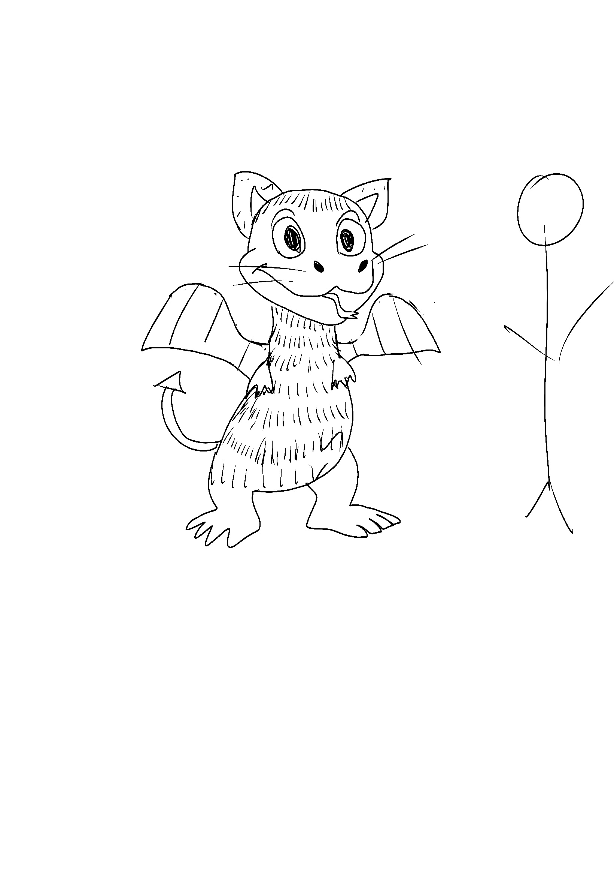
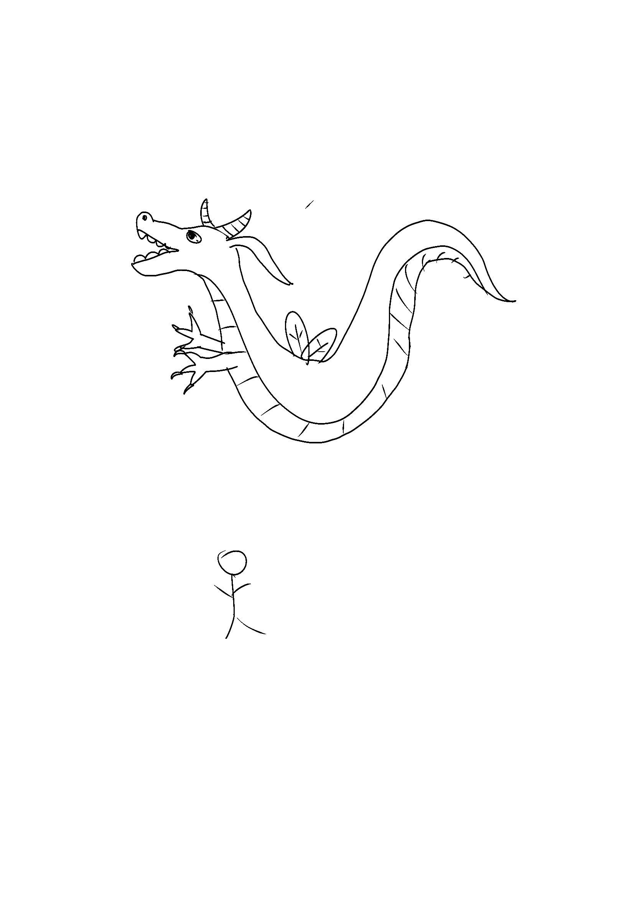
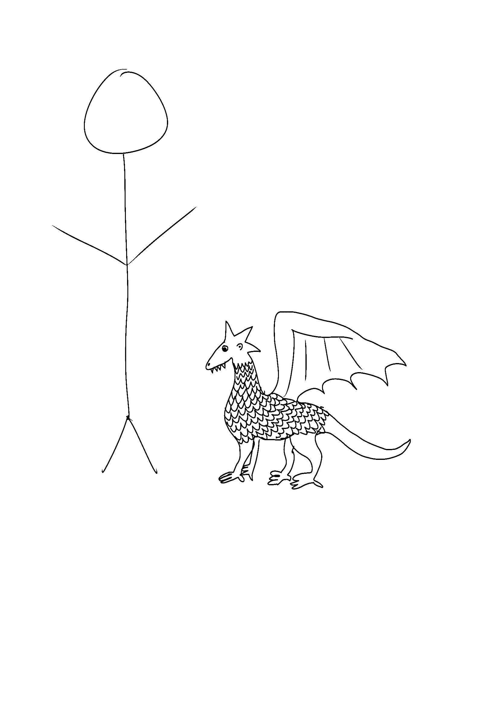

## Github link:

<https://github.com/amyrewells/biol432_As08.git>

## Load libraries

```{r}
library(ape)
library(ggplot2)
library(viridis)
library(reshape2)
library(BiocManager)
library(ggtree)
```

## New dragon traits

| Trait             | Dragon 1           | Dragon 2           | Dragon 3           |
|------------------|------------------|------------------|-------------------|
| Appendages        | Four, 1001         | Two, 1101          | Four, 1001         |
| Mass              | 1-2x human,0011    | \>4x human,1111    | 1/4 human,0000     |
| Body              | Rotund,00          | Snakelike,11       | Elongate,01        |
| Claw              | Absent,0000        | Long Catlike,1100  | Absent,0000        |
| Dorsal ridges     | Absent,000000      | Absent,000000      | Absent,000000      |
| Ear morphology    | Spearlike,010      | Other,001          | Round or Small,100 |
| Eye morphology    | Large,001          | Avg,000            | Avg,000            |
| Eye position      | Forward,1          | Lateral,0          | Lateral,0          |
| Horn type         | Absent,000         | Med/Long,110       | Jagged/Antlers,111 |
| Nose Position     | NA,?               | NA,?               | NA,?               |
| Nasal morphology  | other,0            | Upturned,1         | other,0            |
| Skin-dorsal       | Hairy,000110       | Smooth Skin,110000 | Fish Scales,000000 |
| Skin-head         | Smooth Skin,110000 | Smooth Skin,110000 | Smooth Skin,110000 |
| Skin-ventral      | Hairy,000110       | Plates,000001      | Fish Scales,000000 |
| Snout type        | Absent,0000        | Moderate,1100      | Moderate,1100      |
| Tail type         | Sepear,01          | Blunt/Point,10     | Blunt/Point,10     |
| Teeth             | NA,????            | Blunt Only,1100    | Pointy Only,0000   |
| Toes-opposing     | No,1               | No,1               | Yes,0              |
| Toe Number        | Four,1100002       | Three,111000       | Four,110000        |
| Tongue length     | Short,0            | NA,?               | NA,?               |
| Tongue morphology | Forked,01          | NA,??              | NA,??              |
| Ventral plates    | No,0               | Yes,1              | No,0               |
| Whiskers          | Long,11            | Absent,00          | Absent,00          |
| Wing structure    | Full,11            | Full,11            | Full,11            |
| Wing type         | Hybrid,001         | NA,???             | Bat,100            |

Notes: I do not understand the difference between a lateral ad forward nose, so this row is left as NAs. The wing type of Dragon 2 does not fit with the classification, so NA is assigned.

## Append dragons to Nexus

#### create list to store info on each dragon
```{r}
Dragon1<-c("00100110000000000000100011000?0000110110000000110000001????1110000200101111001")
Dragon1_list <- strsplit(Dragon1, split = "")[[1]]

Dragon2<-c("110111111111000000000010000110?111000011000000000111001011001111000???10011???")
Dragon2_list <- strsplit(Dragon2, split = "")[[1]]

Dragon3<-c("100100000100000000001000000111?000000011000000000011001000000110000???00011100")
Dragon3_list <- strsplit(Dragon3, split = "")[[1]]
```

#### append
```{r}
DragonNexus<-read.nexus.data("./data/DragonMatrix.nex")

DragonNexus$"75American" <- c(DragonNexus$"75American", Dragon1_list)
DragonNexus$"76American" <- c(DragonNexus$"76American", Dragon2_list)
DragonNexus$"77American" <- c(DragonNexus$"77American", Dragon3_list)

```

#### save as new .nex file
```{r}
write.nexus.data(DragonNexus, file = "./input/NewDragonNexus.nex")
```

## add weights

#### create single vector of weights
```{r}
WeightsDat<-read.csv("./data/Weights.csv")
Weights<-paste0(WeightsDat$Weight,collapse="")
Weights<-strsplit(Weights,split="")[[1]]
```

#### convert letter to weight value
```{r}
WeightsNum<-rep(NA,length(Weights))

for(i in 1:length(WeightsNum)){
  if(Weights[i] %in% LETTERS){
    WeightsNum[i]<-which(LETTERS==Weights[i])+9
    } 
  else {
    WeightsNum[i]<-Weights[i]}}

WeightsNum<-as.numeric(WeightsNum)
          
```

#### multiply by weight
```{r}
WtDragonNexus<-DragonNexus

for (i in 1:length(DragonNexus)){
  RepWeight<-DragonNexus[[i]]==1
  WtDragonNexus[[i]][RepWeight]<-WeightsNum[RepWeight]
  RepWeight<-NA}
```

## images of Dragons




Create a visually attractive phylogeny. Use coloured lines to highlight the lineages where your dragons appear on the Dragon Phylogeny.

## phylogeny 
#### create distance matrix
```{r}
WtDragonNexusDF<-data.frame(matrix(unlist(WtDragonNexus),ncol=78,byrow=T))
row.names(WtDragonNexusDF)<-names(WtDragonNexus)

WtDragonDist<-dist(WtDragonNexusDF,method='euclidean')

WtDragonDistMat<-as.matrix(WtDragonDist)

WtPDat<-melt(WtDragonDistMat)
names(WtPDat)<-c("Query","Subject","Distance")
          
ggplot(data = WtPDat, aes(x=Query, y=Subject, fill=Distance)) +
  geom_tile() +
  scale_fill_viridis(option="magma") +
  theme(axis.text.x = element_text(angle = 90, hjust = 1, vjust = 0.5))
```
Figure 1. Weighed Distance Matrix of Dragon phylogenies. Weighs were assigned to morphological traits based on the how conserved they are across evolution, with more highly conserved traits having a higher weight. 

#### create simple tree
```{r}
WtDragonTree<-nj(WtDragonDist)

tree<- ggtree(WtDragonTree, layout="rectangular") +
  geom_nodelab(aes(x=branch,label=node), vjust=0, size=2)+
  geom_tiplab(size = 3, color = "lightblue") 

print(tree)
```

#### add group to distinguish recently added dragons
```{r}
dragon_tips<- c("75American", "76American", "77American")
tip_labels <- tree$data$label
group <- ifelse(tip_labels %in% dragon_tips, "New", "Original")
tree$data$group <- group

```

#### create better phylogeny
```{r}
better_tree <- ggtree(WtDragonTree, layout = "rectangular") +
  geom_tiplab(aes(color = group), size = 2) +
  geom_tree(color = "lightblue") +
  theme_tree() +
  scale_color_manual(values = c("New" = "red", "Original" = "black"))+
  labs(title = "Dragon Phylogeny")

print(better_tree)
```
Figure 2. Dragon Phylogeny based on morphological traits. Newly classified dragons are highlighed in red. Phylogeny contains 80 Dragons total. 

## Interpretation
Dragon 2 and Dragon 3 are more closely related to eachother than either are to Dragon 1. This is based on morphological traits, however, so classification may improve once genetic evidence becomes available. 
